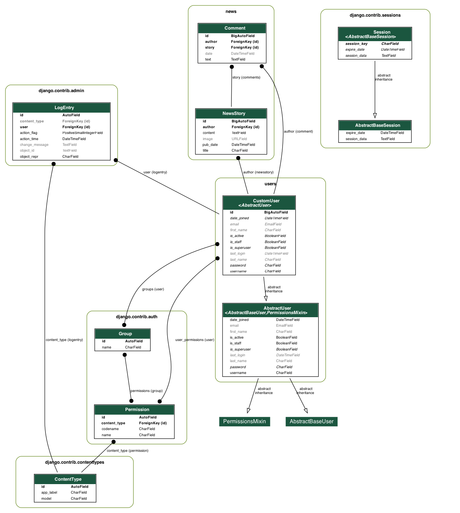

 # Lindi Harding - She Codes News Project
 
 ## About This Project
 
This project is a news website created for She Codes Plus Django Module. Visitors can view 
- 'latest news'
- 'other news'
- 'contrubitions' (news and comments) by author

Registered users who are logged in can interact by
- making contributions (news storys and comments)
- view their personal profile information including a history of their contributions

Extra features are included to assist with smooth site navigation and readability
- links from author name  to author page
- links from username to user profile page
- links from author comments / user comments to related story
- after a succesful log in, the user is returned to the page they intended to visit
- comment section formatting and styling mimics conversation style

 ## How To Run This Code
 
1. Clone the repo
2. Set up a virtual environment 
    - Change directory into the repo you just cloned and create a new virtual environment using: 
    `python -m venv venv`
    - Activate the environment
        - Windows: `.venv/Scripts/activate`
        - Mac: `source venv/bin/activate`
    - Install the requirements
        `python -m pip install -r requirements.txt`
3. Make the initial migrations
    - Change directories so that you're next to the manage.py file. 
    - Make the initial migrations using `python manage.py migrate`
    - Test that this is working correctly by running the server `python manage.py runserver`

## Database Schema

## Project Features
- [x] Order stories by date  
- [x] Styled "new story" form  
- [x] Story images  
- [x] Log-in/log-out  
- [x] "Account view" page  
- [x] "Create Account" page  
- [x] View stories by author  
- [x] "Log-in" button only visible when no user is logged in/"Log-out" buttononly visible when a user *is* logged in  
- [x] "Create Story" functionality only available when user is logged in  

## Additional Features:
- [x] Record and display published time with published date [ {{ Description of image }} ]( {{ ./relative_path_to_image_file }} )
- [x] Add the ability to add comments to a story, and see the 
history of comments added to a story, ordered by comment date [ {{ Description of image }} ]( {{ ./relative_path_to_image_file }} )
- [x] View comments by author within the author page[ {{ Description of image }} ]( {{ ./relative_path_to_image_file }} )
- [x] Links to author page from story comments, story author[ {{ Description of image }} ]( {{ ./relative_path_to_image_file }} )
- [x] View comments by user within the user profile page [ {{ Description of image }} ]( {{ ./relative_path_to_image_file }} )
- [x] Links to story page from author and user comments [ {{ Description of image }} ]( {{ ./relative_path_to_image_file }} )
- [x] Comment section styling added to mimic converation styling[ {{ Description of image }} ]( {{ ./relative_path_to_image_file }} )

